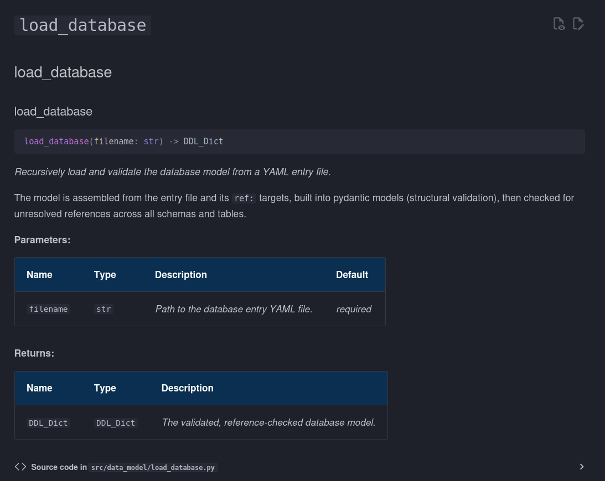

# Building Community

Research success depends on building community. You are building relationships among people, ideas, project participants, human and non-human, and with organizations and funding agencies.

Limiting conflict often requires us to establish _norms_ early on in the process. We want to make it clear what is acceptable, and what is unaceptable. In our relationships around software and coding the same rules applies. A Code of Conduct is a common feature of software repositories. It establishes how people are expected to relate to one another, and it provides a machanism to exclude (and possibly report) individuals who fail to meet our expectations.

Codes of conduct and contribution guides also help people understand how they can partipate. Think of them as simple "onboarding" documents. They tell people how to work with your code, and how to suggest improvements. They can also tell people how to address bugs in your code politely, and without leaving a note that simply says "something's broken".

These are fairly simple additions to a repository that can help make it a more welcoming place. It's also a good way of saving you time in the future. Set these up now and if someone wants to take a look you don't have to walk them through everything, you can just send a link and let them take a look at what's there.

## Documentation

Documentation is critically important for any software. It's important for you, so you can revisit your code, it's important for you to actually plan out what you're doing (there's a whole philosophy of coding called document-driven programming), and it's helpful for whoever is following behind you, so they can understand the ideas behind the code, rather than just figuring out what's actually happening.

Aside from code documentation (below), you also need to provide some documentation for your project. You can do this as part of a `README` file, but these should generally be simple documents that provide a brief overview of the project and how to install and run it.

More complicated material should be saved for proper documentation. We prefer using Markdown through `mkdocs` for Python, and Markdown with `bookdown` for R. The advantage of these two platforms is that they can build clean websites that are linked directly to your project, and can be published online.

Tools like mkdocs and bookdown also have plugins and other tools that let you include your code documentation as part of your actual documentation.  For example, `mkdocstrings` in Python will read the files you've written, take your docstrings and build a page defining the function, its inputs and outputs:



### Python

Python documentation happens through `mkdocs`. If you choose to include documentation in your project, the template will install `mkdocs` and initialize a new documents folder (`docs`) for you automatically.

The initial file (`docs/index.md`) will just be a boilerplate `mkdocs` file, but you can render the site using the command:

```bash
uvx mkdocs serve
```

From here you will be able to get a version of your intial website.

The `mkdocs.yml` file includes more options for you. Mkdocs is highly customizable, so consult the [documentation online].

### R

R Project documentation is often generated using `roxygen2`. `roxygen2` is a metadata language. Individual entries are identified using a field, like:

```R
#' @title The name of the Function
```

Using this, `roxygen2` is able to pull the tags associated with individual functions and generate documentation for you.

### Publishing your Documentation

GitHub pages provides a useful way for you to publish your documentation. With GitHub actions you can automatically publish your documentation as you build. For example, each push to your `main` branch can be accompanied by a push to `gh-pages`.

## Recognizing Funders

Many funding organizations have defined ways in which they expect to be recognized. For example, NSERC has [clear acknowledgement guidelines](https://nserc-crsng.canada.ca/en/funding/policies-and-guidelines/acknowledgement-and-logos) that they expect funded projects to follow:

> We acknowledge the support of the Natural Sciences and Engineering Research Council of Canada (NSERC), [funding reference number xxxxxx]

Not only does this help recognize the contribution of the agency, it also helps identify your engagement with different funding agencies. More broadly, clearly acknowledging funding agencies helps with our goal of "Findable" research products. It is possible to develop search patterns that can help us link grants to publications to code to people, and so on. These kinds of knowledge webs can help make our other work more discoverable.

### Funder Badges

In Markdown (for example, in our README) we can build "badges". These badges look something like this:

[](https://github.com/UBC-DERC/derc_copier/actions/workflows/validation.yml)

Some badges are static, meaning the information they display is directly encoded in the badge itself. Badges can also be dynamic, for example, a badge to show the number of times software has been downloaded or forked.  We built our *Funder Badges* as static badges:

[]()

Badges take advantage of Markdown to create a simple image tag that can be linked to a URL:

```
[]()
```

We have a standard markdown link:

```
[                                                                      ]()
```

That contains an SVG image:
```
 
```

With alt-text:

```
 
```

The SVG is provided by [shields.io](https://shields.io/), a service that exists to make badges easier to use.

Given this, you could also create your own badge, and, if you have a URL that specifically links to your grant online (for example through FundRef), you could add it to the badge as well, so anyone clicking on it would arrive at the grant's landing page.
