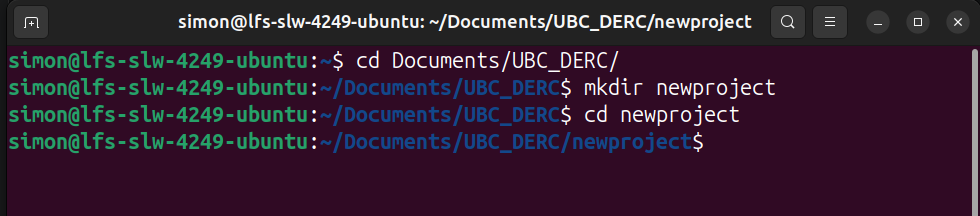

# Building Your Project

Once the [tools are installed](installing.md), you're ready to generate a project
from the template.

## Choosing how many questions to answer

When you build a project, the first question asks which **profile** you want. This
controls how many of the setup questions you'll be asked:

- **Recommended** &mdash; a curated set of questions covering the best-practice
  elements for research software. This is the best starting point for most people.
- **Minimum** &mdash; the bare minimum questions, with no extra features. Good if
  you want to get going quickly and add things later.
- **Let me enter each feature myself** (`ask`) &mdash; every available question,
  for full control.

Whichever you choose, none of it is permanent: you can always change your answers
later (see [Keeping your project in sync](updating.md)).

## Running the template

Imagine we've decided to create a new project called `newproject`. First create a
directory called `newproject`, then open your shell (PowerShell, Terminal, or
another) and move into that directory:



Once we're in that directory you can create your new project from the template. The
`.` tells `copier` to build the project into the current directory:

```bash
copier copy https://github.com/UBC-DERC/derc_copier . --trust
```

### Why `--trust`?

The `--trust` flag is required. This template does useful work for you *after* the
files are written &mdash; it initialises a `git` repository and makes your first
commit, and for R projects it sets up `renv`. `copier` will not run these
post-generation tasks unless you explicitly trust the template with `--trust`. Only
pass this flag for templates you trust (like this one).

## Your answers are saved

Building the project will present you with the opportunity to provide full answers,
or choose a minimum set of questions. Your answers for these questions will be
stored in a file called `.copier-answers.yml` in your project directory.

Whether you choose to answer all questions, or just a minimal set, you can always
go back and edit the answers in the `.copier-answers.yml` file:

```yaml
# Changes here will be overwritten by Copier
_commit: 52d9952
_src_path: https://github.com/UBC-DERC/derc_copier
author_formal: Goring
author_given: Simon
author_orcid: https://orcid.org/0000-0002-2700-4605
code_of_conduct_lang: code_en
copyright_year: 2026
license_type: MIT License
lifecycle: lifecycle_planning
project_description: Importing and processing scholarly work by DERC contributors
    using open-access sources.
project_name: scholarship-import
project_repository: UBC-DERC
template_profile: recommended
```

The two keys beginning with an underscore are managed by `copier` itself, so you
normally shouldn't edit them by hand:

- `_src_path` records **which template** your project came from.
- `_commit` records **which version** of that template was used.

Together they are what allow `copier update` to find the template again and work
out what has changed. See [Keeping your project in sync](updating.md) for how to
edit your answers and pull in template improvements.

## What happens next

After the files are written, `copier` prints a short summary and (because you
passed `--trust`) runs the setup tasks described above. At that point you have a
working, version-controlled project.

You can work in whichever editor you prefer &mdash; **VSCode**, **Positron**, or
**RStudio** all work with these projects, and the included `.editorconfig` keeps
formatting consistent across all of them. Open the **project folder** (the
directory you generated into) in your editor rather than a single file. A couple of
common next steps:

- **Python projects:** run `uv sync` to create the project environment and install
  dependencies.
- **R projects:** `renv` has already been initialised for you. If you use RStudio
  or Positron, opening the generated `.Rproj` file will load the project and its
  `renv` environment automatically; in VSCode, open the folder and the `.Rprofile`
  activates `renv` when you start R.

For a full explanation of every file in your new project and what it's for, read
the `project_setup.md` file that was created in your project directory.
